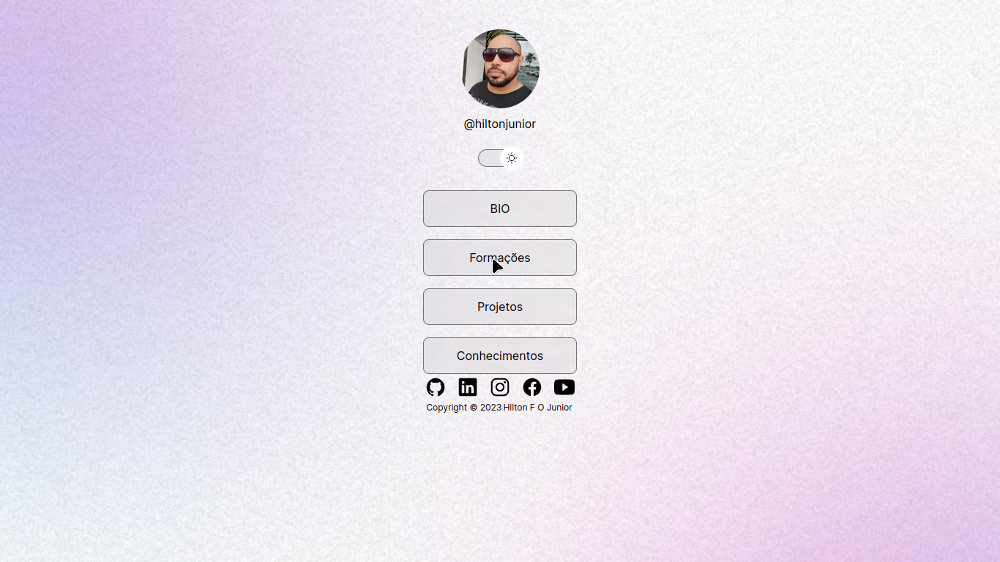

<h1 align="center">
  PDevLinks
</h1>

<blockquote align="center">“Sou minha única limitação ”!</blockquote>

  

  <a href="#">Bio</a>
   <a href="#">Formações</a>
 <a href="#">Projetos</a>
  <a href="#">Conhecimentos</a>

  

  <a href="#rocket-sobre-o-desafio">Sobre o desafio</a>&nbsp;&nbsp;&nbsp;|&nbsp;&nbsp;&nbsp;
  <a href="#calendar-entrega">Entrega</a>&nbsp;&nbsp;&nbsp;|&nbsp;&nbsp;&nbsp;
  <a href="#memo-licença">Licença</a>

## :rocket: Sobre o desafio

Nesse desafio, tive planejar os meus estudos.

para isso criei um cronograma que foi se adaptando ao meu tempo e ritmo.

### Modelo de cronograma

Para te ajudar nesse desafio, usei o Notion.

O Notion funciona tanto em plataformas mobile, tanto em plataformas desktop, e ambas podem ser baixadas em sua [página oficial](https://www.notion.so/product).

Para começar a utilizar o modelo,  acessei este o link disponibilizado abaixo, e clicar no botão "Duplicate" que fica no menu do canto superior direito da tela.

📄 **[Link para o modelo](https://www.notion.so/Cronograma-de-estudos-e390bc8d2f5743668ec03348a3306070)**

### Definindo o cronograma semanal

  

Nessa sessão você deve informar os horários fixos que você irá se dedicar durante a sua jornada como programador, afinal, a rotina de estudos será o primeiro passo para você conseguir atingir os seus objetivos o mais rápido possível!

### Definindo o cronograma diário

  

Agora você deve planejar suas tarefas diárias para que você consiga estar preparado para todo o conteúdo que irá consumir durante a semana.

Aqui você pode seguir o modelo disponibilizado abaixo para criar seu próprio calendário de estudos, para que você consiga sempre se manter organizado e focado nos seus objetivos.

Nesse modelo já deixamos preparados tudo o que você pode fazer para essa primeira semana de conteúdos do Bootcamp, você apenas precisará adaptar ao seu ritmo.

Dica: Adicione conteúdo extra como leituras e podcasts, lembre-se de ter pequenas pausas para descansar e assimilar o material estudado. Adicione também tempo reservado para criação de conteúdos, como posts em um blog pessoal ou linkedin.

## :calendar: Entrega

Esse desafio deve ser entregue a partir da plataforma da Rocketseat. Após concluir o desafio, fazer um post no Linkedin sobre ele é uma boa forma de demonstrar seus esforços para evoluir na sua carreira para oportunidades futuras.

## :memo: Licença

Esse projeto está sob a licença MIT. Veja o arquivo [LICENSE](../LICENSE) para mais detalhes.

---

Feito com 💜 by Rocketseat :wave: [Entre na nossa comunidade!](https://discordapp.com/invite/gCRAFhc)